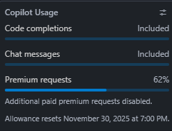
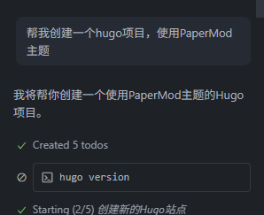
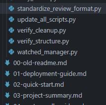
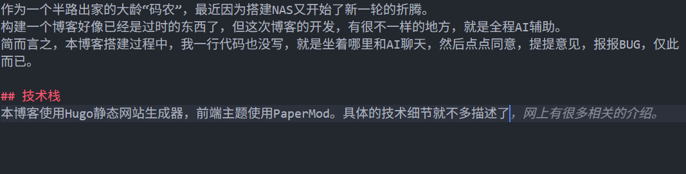

## 总体感受

作为一个半路出家的大龄“码农”，最近因为搭建NAS又开始了新一轮的折腾。
构建一个博客好像已经是过时的东西了，但这次博客的开发，有很不一样的地方，就是全程AI辅助。
简而言之，本博客搭建过程中，我一行代码也没写，就是和AI聊天，仅此而已。

## 技术栈
本博客使用Hugo静态网站生成器，前端主题使用PaperMod。具体的技术细节就不多描述了，网上有很多相关的介绍。

搭建使用VSCode作为主要的编辑器， AI辅助是copilot插件，全程Agent模式，模型为Claude Sonnet 4.5。
整体消耗了50%左右的月度Token配额。下图截取晚了，有一部分是后来正常工作消耗的。

## AI辅助开发体验

整个博客的搭建过程大概持续了一周。

作为一个人，期间主要完成的工作内容就是构思想要的效果，给AI提需求，然后点点同意，提提意见，报报BUG。
AI完成了全部的代码编写，配置文件生成，历史内容导入等工作。它创建了很多的脚本来完成任务，甚至在搭建中还生成了很多说明类、教程类的文档。下图仅是其中的一部分，又不是在过程中已经废弃清理掉了。对了，清理的工作也是AI完成的。

甚至，我在写这边文章的时候，AI也在帮我润色和补全内容。

整个过程下来，最大的感受就是码农要死绝了。
作为一个非专业的开发者，也是第一次接触Hugo，甚至是go，很多技术细节都不懂，可以说是一窍不通。
但我有AI，让我超脱出代码的细节，能够专注于内容和创意本身。

## 开发过程中的问题
在整个开发过程中，AI也遇到了一些问题。
可能是Hugo多语言资料不多，AI在多语言配置方面遇到了多种问题，来回尝试了很多方案，连项目整体结构的翻来覆去的改过几次。
后来，我也有问过ChatGPT（免费版），它给出的方案比Claude Sonnet 4.5更合理一些。

还有一个问题是，也可能是我的VS Code配置不对，整个开发过程还是需要全程关注，因为AI每个步骤都会编写脚本，或运行Shell代码，这都需要用户点击同意。个别时候还要向AI反馈一些运行结果。所以，屁股和腰并不轻松。

## 未来展望

### 码农没有未来
这次的开发过程，最深刻的感受就是，码农这个职业真的没有未来了。AI已经能够胜任绝大部分的代码编写工作，复杂的需求它也会尝试多种方案来实现。可能效率上不如资深熟练工，但我相信绝大多数码农活不到成为熟练工的那一天。

### 什么人能生存下去
能在未来的AI时代生存下去的人，必然是那些能够驾驭AI工具，在多个AI平台付费，能敏锐抓住市场变化，并知道如何提出高质量需求的人。

### 下一步开发计划
未来，我计划继续完善博客的功能，比如增加评论系统，SEO优化，内容推荐等功能。
1. 优化照片墙的布局。当前布局只有两栏，我想要的效果是不分栏，照片自动加载填充。
2. 影评系统自动获取影片信息，包括IMDB和豆瓣实时评分，并拉取一些影片基本信息。
3. 图片全部从个人图床外链，节省博客空间。
4. 自动化同步到一些其他平台。

以上就比较明确的想法。当然，未来最重要的是保持一定的更新频率，持续产出内容。也希望能吸引更多的关注和参与。