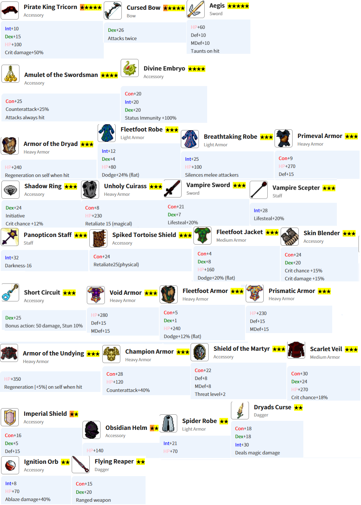

# 小众游戏推荐 ——致不死的少年心

作为一名二孩奶爸，时间是不属于自己的。有无穷无尽的杂务等着张罗，有精力无限的怪兽等着降伏，有掏空钱包的梦想等着拔草。百忙之中，随时掏出手机玩会游戏，已经是难得的放松。

可惜，现在的游戏产商追求又肝又氪，可选可玩的太少。故而，这个系列应运而生。

这里推荐的，都是我真的玩过不少时间，调性、质量、体验都可圈可点的游戏

## 入选标准：
- 可以随时锁屏离开。
- 既要护肝，又要晋老西儿。
- 没有漫天飞舞的广告。
- 不用搓玻璃。人老了，一切要不断操作的游戏都是反动派。

## 备选游戏
- 
- 
- 

## Idle MMO

### 简介

这个游戏是一款类melvor的放置MMORPG游戏，目前电脑和手机都可以玩。电脑直接用浏览器即可，steam上暂时没找到。手机上有APP，闲麻烦就要浏览器也行。

#### 优点
简单说，就是几个生产类技能，另外还有战斗。但它也有自己的特色：
- 类网游，有公会、拍卖行等功能，不想社交的自己闷头玩也可以。
- 可以做到完全免费。它的月卡、token都可以在拍卖行用金币买到。
- 有不同难度区分。有几种特殊职业：降低经验获取的，禁用社交功能的，以及前两种的结合体。
- UI风格现代。
- 据说开发组密切关注游戏经济运作，有专门的金币消耗功能（说的就是你，房屋）。

#### 缺点
- 暂时没有中文，本地化正在逐步推进。
- 限制单账户。

### 进度
主角色：CL 58，几个生产类在50左右，消耗类基本没动。
副角色：全职生产。

### 交友
欢迎使用我的链接注册，都能拿到碎片（用于兑换头像等）：

在游戏里面建立了一个小公会，游戏中搜索公会名'YYDS'即可。目前博主还在提升自己，所以公会等级很低。

## Idle Guide Master

### 简介
这是一个纯单机、节奏很慢的放置游戏，只找到了手机端。

#### 优点
- 可供游玩很久
- 界面无广告，每天看5个广告给点钻石。当然可以选择充值免广告。
- 节奏非常慢。我一个副本刷一个星期都没能通关（自我嘲笑）。

#### 缺点
- 只有手机端
- 资料较少，甚至英文资料也不多。我会总结一些供参考。

### 进度
主队D6，另外2组2人刷D1/D2。

### 心得

#### 队伍规划

初始招募以下几个角色
主坦：步兵 - 战士 - 守卫 - 铁卫
治疗：学徒 - 光明门徒 - 牧师 - 白魔法师 - 白大法师
远程：弓手 - 女猎手 - 神射手 - 必中手 - 愤怒
近战：盗贼 - 窃贼 - 暗影爬行者 - 暗影舞者 - 夜之刃 - 夜魅影
法系：学徒 - 熟练者 - 火系法师 - 红魔法师 - 红大法师

后续补充：
第三个输出，推荐火法，等不来弓手也行。
第二个治疗。可以多一个白法师，也可以考虑吟游（贼 - Trickster - Silver Tongue - Minstrel - Bard）
第四个输出，弓手（炼金：弓手 - 女猎手 - 神射手 - 毒弓 - Toxic Stalker - 炼金），或者法师（可以考虑死灵法师，纯单刷：学徒 - 熟练者 - 黑暗术士 - 死灵法师 - 解放者）。

这个时候已经有一队攻坚推进度，两或三组刷材料赚钱。再往后就是考虑补充还没有的职业，优先补一个皇家卫士（强力单刷战士，步兵 - 战士 - 守卫 - 皇家）。然后看心情选其他。

#### 职业路径及梯度
职业晋升路线参考韩国人的资料站：。
点击右上角可以切换英语，或者使用网页翻译工具。

- T1: Celestial Rain, Divine Duelist, Eidolon   天雨、神圣决斗者、幻灵
- T2: Night Lament, Whisper, Eternal Fortress, Eldritch Alchemist   夜之哀歌、低语、永恒堡垒、远古炼金术士
- T3: Inferno, Wyrm Rider, Angel of War, Black Regent   炼狱、巨龙骑士、战争天使、黑色摄政王
- NA: Archangel, Balrog 大天使，巴洛格

#### 装备选择
总体原则：为了推进度，推荐尽快制作更换当前最高副本材料制作的装备。尤其要重视头盔，是推进度的好帮手。
另外可以参考这个装备推荐

#### 各副本建议
副本会有进度要求，比如杀100个怪，退出或团灭会重制计数。每个副本会有一些隐藏/稀有怪物或掉落
D1: 稀有怪金兔，打死后刷隐藏元素。前中期不用纠结这个，很难。
D2: 队伍必需有弓手，因为贼打不到飞鸟怪，还有这里怪物有魔防。不用纠结100个怪的计数，完成后只是连续几波沙人。
D3: 最好双火法，因为隐藏怪鬼火完全不吃物理伤害。鬼火的稀有掉落会吸引你回来刷一万遍的。
D4: 混搭物理魔法输出。要给脆皮配头盔。这里的稀有掉落腐化匕首，是你固定一队在这里的原因。
D5: 非常好的副本，任何输出都行，掉落大量食物，珍珠可以直接卖钱。留在这里直到你的队伍上限足够多。
D6: 拦路虎。伤害很高，物理防御极高，初期通过不断灭团来获得一些材料，制作一些回血装备。然后靠运气刷够计数激活下一个副本。
D7：感觉难度甚至比D6低。这里有一种魔免怪，要用纯物理队刷。这里装备很好，尽快刷材料提升战力。
D8：TBD

#### 如何赚钱和花钱
获得的材料不要直接买，加工会带来150%售价提升。
所以，赚钱的方法就是，分刷材料，制作，卖店，循环往复。

初期，集中资源购买队伍栏位。中期少量投入背包、工坊、商店。
宝石/商店：嘲讽剑是坦克毕业装。猩红装备太贵，量力而行。不要购买任何药水，可以掉落。
氪金：一旦你进入D6，背包空间就会非常紧张。有条件就购买新手包，否则只能升级背包，而放慢队伍进度。

#### 宠物评价
- "好奇"是目前最强的特质，几乎所有宠物都应该把它放在第一或第二栏位
- "魔法"是一种糟糕的特质，某些魔法状态甚至会造成严重的损害
- "保护"虽然不至于有害，但它的效果不足以弥补占用技能栏位的不足
- "嗜血"和"抚慰"在单人刷D1-D3时效果相近（两者都很棒），但它们作为第二特性会更好，第一特性应该是好奇
- "治疗"在单人模式下稍逊一筹。它真正的优势在于作为主力团队宠物的第二特性
- "斗士"、"机会主义"和"野蛮人"都是“快速杀敌”的选项。斗士更适合游戏前期，而另外两个则在后期才能真正发挥作用
- "明亮"、"诱饵"和"警惕"这三个特性都只在特定的单人刷图策略中才有用途。"诱饵"和"明亮"尤其适合单人 D6
- "机会主义"和"明亮"是少数适合第三个技能槽位的特性。

## Idle Iktah

### 简介
这是一个生产/战斗放置游戏，有和手机端。只是同步略复杂，需要先上传进度获得一串下载码，然后在另外一边输入下载码。

#### 优点
- 技能较多，消耗时间
- 广告非常克制，经常遇到5秒的广告

#### 缺点
- 离线时间较短，最多5小时。有床可以满5小时领一个梦境箱子，开出的梦境水晶是制造材料。
- 技能繁杂，70级左右开始升级困难
- 训练徒弟基本是废物，浪费时间和经验，还需要刷出任务状才能安排生产。

### 进度
生产类技能75 ~ 80区间，制造类50左右，战斗40
